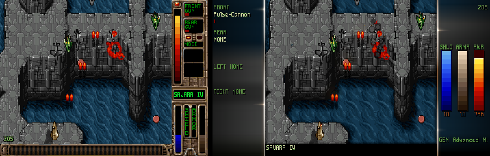
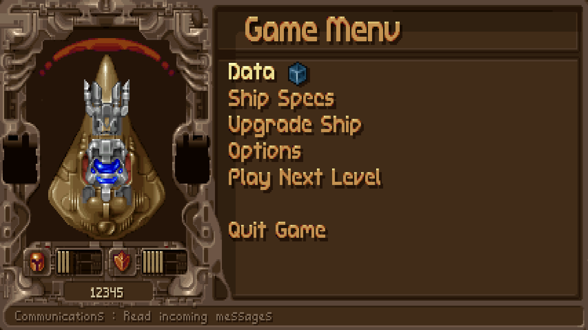

<p align="center">
  
</p>

<p align="center">
  <a href="https://github.com/vittau/modern-tyrian/releases/latest"></a>
  <a href="https://github.com/vittau/modern-tyrian/actions/workflows/linux.yml"></a>
  <a href="https://github.com/vittau/modern-tyrian/actions/workflows/macos.yml"></a>
  <a href="https://github.com/vittau/modern-tyrian/actions/workflows/windows.yml"></a>
  <a href="COPYING"></a>
</p>

<p align="center">
  <b>Tyrian 2.1</b> — Eclipse Software's 1995 vertical arcade shooter —<br>
  running on SDL3, with a modern presentation layer on top.
</p>

<p align="center">
  The original game logic runs untouched: an 8-bit 320×200 frame at the same
  fixed tick, the same RNG, the same demos. <b>Modern mode</b> adds a widescreen
  canvas, the HUD moved into glass side panels, motion interpolated at the
  display refresh, bloom and dynamic lighting, procedural VFX and
  sharp-bilinear HiDPI output — all computed on the original pixel grid.
</p>

<p align="center">
  
</p>

## 

Download the latest build from [Releases](https://github.com/vittau/modern-tyrian/releases/latest),
extract it, and run it. Each archive carries everything needed to play: the
executable plus the freeware **Tyrian 2.1** data files. The game has a story
campaign, one- and two-player arcade modes, and networked play.

| System | File | Run |
| --- | --- | --- |
| Linux (x86_64 / arm64) | `opentyrian-<version>-linux-x86_64.tar.gz`, `…-arm64.tar.gz` | extract, then `./opentyrian` |
| Windows (x86_64 / arm64) | `opentyrian-<version>-windows-x86_64.zip`, `…-arm64.zip` | unzip, then `opentyrian.exe` |
| macOS (universal, Intel + Apple silicon) | `opentyrian-<version>-macos-universal.zip` | unzip, then open `OpenTyrian.app` |

Every normal start opens the built-in launcher. Select **Tyrian 2.1** or
**Tyrian 2000** with Left/Right and Enter, the gamepad's d-pad/left stick and A,
or the mouse; Esc/B exits. The last choice only preselects a panel. The 2000
panel shows **INSTALL** until its separate data validates. INSTALL opens a dialog:
download it from camanis.net (about 5 MB, with a progress bar and Cancel, using
the system `curl`), install from a `.zip`, or use an existing folder such as a GOG
copy. Where no file dialog exists (Steam Deck Game Mode) the zip and folder choices
show where to put the files instead, and **Look now** picks them up. The data is
installed per user, and the download's temporary file is removed afterwards:

| OS | Tyrian 2000 data |
|---|---|
| Windows | `%APPDATA%\OpenTyrian\data-tyrian2000` |
| macOS | `~/Library/Application Support/OpenTyrian/data-tyrian2000` |
| Linux / SteamOS | `$XDG_DATA_HOME/opentyrian/data-tyrian2000`, else `~/.local/share/opentyrian/data-tyrian2000` |
| Portable mode | `data-tyrian2000/` beside the executable |

You can also set `TYRIAN2000_DATA` or place the data in `tyrian2000/` beside the
executable. About shows the data paths.
`--variant=2.1` or `--variant=2000` skips the launcher for automation; regression
and selftest runs also skip it. Tyrian 2000 data is never included in releases.

The Linux binaries are statically linked against SDL3 and only need glibc, so
they run as-is on SteamOS, Arch, Fedora and Debian. On a Deck, see the
**Steam Deck** section below.

> [!NOTE]
> The builds are not signed with a paid certificate, so the OS asks once before
> the first launch.
>
> - **macOS** says it can't verify the app. Open **System Settings → Privacy &
>   Security**, scroll to the OpenTyrian notice and click **Open Anyway**. From
>   a terminal:
>   `xattr -dr com.apple.quarantine "/Applications/OpenTyrian.app"`
> - **Windows** SmartScreen shows "Windows protected your PC". Click
>   **More info → Run anyway**.

Saved games, configuration and logs are kept in one place:

| System | Location |
| --- | --- |
| Windows | `%APPDATA%\OpenTyrian` |
| macOS / Linux | `$XDG_CONFIG_HOME/opentyrian` or `~/.config/opentyrian` |

| File | Contents |
| --- | --- |
| `opentyrian.cfg` | presentation, aspect, scaling, input settings and launcher preselection |
| `tyrian.cfg` | in-game options and key/button bindings |
| `tyrian21/tyrian.sav`, `tyrian2000/tyrian.sav` | separate saved games and scores |
| `opentyrian.log` | log (written automatically on a Steam Deck) |

If an `opentyrian.cfg` exists **next to the executable**, the files are kept
there instead — portable mode, handy for a USB stick. Release archives ship
without a config file, so the default is the per-user directory above.

`Alt+Enter` toggles fullscreen at any time, and **Quit Game** is on the
in-game menu (`Esc`).

## 

The `.tar.gz` is made for the Deck's 1280×800 screen: on first launch the game
starts fullscreen in Modern mode with the aspect on **auto** (16:10 here), reads
the built-in controller through SDL's gamepad API — no Steam Input template
needed — and logs to `~/.config/opentyrian/opentyrian.log`.

In **Desktop Mode**: download the `…-linux-x86_64.tar.gz`, extract it, then in
Steam use *Add a Game → Add a Non-Steam Game…* and pick the `opentyrian`
executable. Leave the launch options empty; head back to Game Mode and it's in
your library. The full walkthrough, controller and troubleshooting notes are in
**[docs/STEAM_DECK.md](docs/STEAM_DECK.md)**.

## 

Pick **Classic** or **Modern** under *Setup → Graphics → Presentation*. Classic
is the original path. Modern is the new one:

| Feature | What it does | Where to change it |
| --- | --- | --- |
| Widescreen canvas | Keeps the 320×200 frame at its size and centers it in a wider canvas; `4:3` … `32:9` or `auto` | Graphics › Aspect |
| Pixel-perfect scaling | Always **sharp bilinear** Fit at the original 1.2 pixel aspect — an integer nearest prescale plus one linear pass | fixed in Modern |
| Glass side HUD | Moves the status and armament into translucent side panels when there is room; the message strip sits below the playfield | automatic |
| Smooth motion | Draws at the display refresh with motion interpolated between the original ~35 Hz ticks | Graphics › Smooth Motion |
| Bloom + lighting | Additive glow on the bright sprites, and wide coloured light cast over the terrain | Graphics › Lighting |
| Procedural VFX | Muzzle flashes, smoke, sparks, shockwaves and impact debris on the pixel grid | Graphics › Effects |
| HiDPI output | Requests the display's native pixels, so Retina screens run at the physical resolution | automatic |
| Starfield speed | Slows the drifting star field to 25% with sub-pixel motion (Classic and Modern) | `--starfield-speed`, config |
| Nuked-OPL3 audio | Emulates the original OPL2 with Nuked-OPL3, resampled in integer math | always on |

The relocated HUD, shown against the original 4:3 frame:

<p align="center">
  
</p>

**Classic keeps the original game.** It draws the same 8-bit 320×200 frame at
the same fixed tick, with the same RNG and the recorded demos. Modern's
presentation layer (widescreen canvas, glass HUD, interpolation, lighting, VFX)
only reads game state and never calls the game's RNG; the one gameplay-facing
difference in Modern is the analog stick response curve, whose full deflection
matches the original speed. The star field is shared by both modes and runs at
25% of OpenTyrian's rate by default — `--starfield-speed=100` (or
`starfield_speed_percent=100`) restores the original rate for byte-exact output.
The regression suite checks all of this on every build (see **Regression
testing** below).

## 

Keyboard defaults — everything but the fixed keys can be rebound in
*Setup → Keyboard*:

| Action | Keys |
| --- | --- |
| Move | Arrow keys |
| Fire | Space |
| Change rear weapon | Enter |
| Left sidekick | Left Ctrl |
| Right sidekick | Left Alt |
| In-game menu | Esc |
| Pause | P |
| Help | F1 |
| Toggle fullscreen | Alt+Enter |

Menus take the arrow keys (the mouse also works) and Enter/Esc for
confirm/cancel.

Gamepads use SDL3's Gamepad API, so a standard Xbox/Deck controller works with
no Steam Input template:

| Control | Action |
| --- | --- |
| Left stick | Movement (analog: radial dead zone + progressive speed) |
| D-pad | Movement (digital: on/off at full speed) |
| South / A | Fire (and Enter/confirm in menus) |
| East / B | Change rear-weapon mode (and Esc/cancel in menus) |
| North / Y | Left sidekick (L1/LB is a second binding) |
| West / X | Right sidekick (R1/RB is a second binding) |
| Start / Menu | In-game menu (the Esc menu) |
| Back / View | Pause (and Esc/back in menus) |

In Modern the analog stick has a **radial dead zone** (0–20%, default 10%) and a
**progressive speed curve**: speed rises linearly from the dead zone up to 75%
of the stick's travel, and from 75% on it is the ship's full speed — never
faster than the original. The dead zone is set per device on the *Setup →
Joystick* screen (shown in place of the threshold row while Modern is active)
and stored as `deadzone` in the device's `joystick` section;
`--deadzone=PERCENT` overrides it for tests. Sub-pixel accumulation keeps very
slow movement smooth instead of sticky, and Classic keeps the original
proportional reduction and its sensitivity/threshold rows unchanged.

Buttons are remappable on the same screen and saved per device: gamepad
bindings by name (`GB a`, `GB leftshoulder`, `GA lefty-`, …), while the legacy
raw-joystick format (`AX 1-`, `BTN 1`, `H 1X+`, …) is still written and loaded
for non-gamepad devices and old configuration files. Controllers can be plugged
and unplugged while the game runs. `--no-joystick` (`-j`) disables all
controller input. Since a physical controller is not always available,
`--selftest-gamepad` runs a headless self-test against SDL virtual controllers:
the default mapping, the Modern dead-zone/response curve (dead-zone edge, 50%,
75% and 100% input, diagonals, sub-pixel creep), hot-plug, the configuration
round-trip and the legacy non-gamepad path, then exits non-zero on failure.

**Network play** is started manually from both machines:
`opentyrian --net HOSTNAME --net-player-name NAME --net-player-number NUMBER`.
It uses UDP port 1333 with hole punching, so neither player usually needs to
open a port.

## 

*Setup → Graphics* holds every presentation setting; they apply immediately.

| Item | Values | Availability |
| --- | --- | --- |
| Presentation | `Classic`, `Modern` | both |
| Aspect | `4:3`, `16:10`, `16:9`, `21:9`, `32:9`, `auto` | Modern only |
| Pixel Aspect | `Original` (1.2), `Square` | Classic only |
| Scaling Mode | `Center`, `Integer`, `Fit` | Classic only |
| Smooth Motion | `On`, `Off` | Modern only |
| Lighting | `Off`, `Low`, `High` (default `Low`) | Modern only |
| Effects | `Off`, `Low`, `High` (default `Low`) | Modern only |

In Modern, Scaling Mode and Pixel Aspect are hidden: the picture is always the
sharp-bilinear **Fit** at the original 1.2 pixel aspect, so there is no worse
option to pick.

The game's own **Detail Level** (in the in-game options: Low, Medium, High,
Pentium) is pinned the same way: Modern always renders at **Pentium**, the full
detail with the translucent second background layer and the level colour
filters, and the row is hidden. Classic keeps the row and your choice, saved in
`tyrian.cfg`; a fresh install defaults to Pentium there too.

<p align="center">
  
</p>

<details>
<summary><b>How Modern mode is composed</b></summary>

The `presentation` setting is also stored in `opentyrian.cfg` (in the `video`
section) and defaults to `classic`. Classic is the original path: the 8-bit
320×200 frame is converted through the palette at 1× and the GPU scales it to
the window. Modern composes an XRGB8888 canvas on the CPU at the logical
resolution and runs its effect passes there. Both presentations are scaled by
the GPU.

In Classic the `scaling_mode` key picks how the frame is fitted to the window:
`Center` draws it 1:1, `Integer` scales it by whole multiples, and `Fit` scales
it proportionally with the sharp-bilinear path. `Integer` is the default. The
`pixel_aspect` key is Classic-only: `original` draws each pixel 1.2× taller
than wide (the 4:3 frame) and `square` draws them 1:1 (the 8:5 frame); `Fit`
uses it to choose the frame, and `Integer` and `Center` ignore it.

Sharp bilinear means an integer nearest-neighbour prescale (the largest that
fits, chosen per axis) into an intermediate render target, then one linear pass
for the fractional remainder. Every source pixel lands on screen at the same
size, instead of the uneven 4/5-pixel rows and columns a direct
nearest-neighbour fractional fit produces, which shimmer while scrolling. The
window is created with `SDL_WINDOW_HIGH_PIXEL_DENSITY`, so on a HiDPI (Retina)
screen the whole path runs at the display's physical resolution instead of
being upscaled by the OS.

The Modern presentation is widescreen. The original 320×200 frame keeps its
size and is centered horizontally in a wider canvas (height stays 200 rows), so
the playfield is never enlarged. The `aspect` setting picks the on-screen
aspect (or `auto` follows the window); the canvas width is
`round(200 × 1.2 × aspect)`, never below 320, and the canvas is presented at
the original 1.2 pixel aspect. The `aspect` setting lives in the `video`
section and defaults to `4:3`.

The `lighting` key (`--lighting=off|low|high`, default `low`) controls the
Modern bloom and dynamic lighting together from one picker; `--bloom` is an
advanced override of the bloom alone. `high` is the strongest level and `low`
is half of it. The `vfx` key (`--vfx=off|low|high`, default `low`) does the same
for the procedural effects.

The `smooth_motion` key (`--smooth-motion=on|off`, default `on`) makes Modern
gameplay present at the display refresh with interpolated motion while the
logic keeps its original fixed tick; it has no effect in Classic. As well as
moving objects, it interpolates the palette fade-in/out between two ticks and
the dynamic HUD bars (shield, armor, power reserve and the boss bars), so the
whole presented frame advances at the display rate instead of stepping at the
logic tick. A new window opens at the content aspect, at the largest integer
multiple of the 200 logical rows that fits in about 80% of the usable desktop,
centered on the display; this is also the Classic default.

The drifting star field (behind some levels, and on the jukebox and weapon
simulator screens) runs at 25% of OpenTyrian's rate by default in both
presentations: each star keeps a sub-row accumulator and advances
`(star speed + level starfield speed) × percent / 100` rows per logic tick, so
the motion is sub-pixel instead of a whole row at a time. The
`starfield_speed_percent` key in the `video` section
(`--starfield-speed=PERCENT`, 10–100, default 25) tunes that factor; `100`
gives the original OpenTyrian speed. It is presentation-only: it never touches
gameplay, the RNG, the game-state hash or the audio.

On non-gameplay frames (title/splash, menus, the shop, story/text screens and
the in-game Esc menu) the side space is filled with a copy of the frame scaled
to the canvas width, heavily blurred and darkened, so it reads as a soft
backdrop behind the sharp, centered frame. It is all deterministic integer
math on the 320×200 grid, allocated only on resize (under 0.15 ms/frame at
16:9). At 4:3 there is no side space and nothing changes.

During gameplay, when both side panels are at least 51 logical pixels wide
(exactly the width of a boss bar), the Modern layout drops the original sidebar
and bottom strip entirely: only the 264×184 playfield is copied out of the
320×200 frame, and the freed columns carry the new HUD. The panels are measured
against the centered playfield (`(canvas_w − 264) / 2`), so 16:10 (60 px)
qualifies as well as 16:9 (81/82 px), 21:9 and 32:9; 4:3 (28 px) and 16:9 with
square pixels (46 px) are too narrow and keep the original full-frame layout.
The 16 rows freed below the playfield are a message strip: the level name on
the top line and the in-game message centered below it.

The panels are drawn as translucent "glass" (a blurred backdrop at 68%–32%
opacity) with a one-pixel text shadow and vertical gradient bars in the style
of the original `JE_dBar3`. Single player uses both panels: the left one shows
the armament (front and rear weapon name, power pips and rear firing mode; left
and right sidekick name, icon and ammo/charge gauge) and the right one the ship
status (name, extra lives, cash, superbombs, shield and armor values with bars,
generator name, the generator/weapon **power reserve** bar, the boss bars and
the level timer). Two players get one compact panel each, player 2 right-aligned
toward the outer edge. Everything is drawn on the original 320×200 logical grid
with the game's own fonts and sprites and procedural frames; the panels widen at
21:9 and 32:9 without changing the layout tiers. The power reserve bar is shown
in every layout. Classic is always unchanged.

Modern gameplay also has two lighting effects, computed on the logical grid and
controlled by the one `lighting` setting; `--bloom` overrides the bloom alone:

- **Bloom** is a tight additive glow around the brightest pixels — shots,
  lasers, explosions and engine flames. The emissive strength comes from the
  largest RGB channel of the active palette entry (so it follows palette fades
  and ignores dark saturated colours), thresholded and blurred with three
  separable box passes, then combined with a screen-style saturating add.
- **Dynamic lighting** is the wide illumination: the same emissive pixels cast
  their colour over the surrounding playfield, so nearby terrain, enemies and
  the ship are lit in the hue of the fire. The colour is the emitting object's
  own dominant saturated shade (its sprite's body colour), not the white-hot
  core of its brightest pixels, so a blue shot casts blue light and a green
  pickup green. It is built at a quarter of the logical resolution, blurred with
  a large box radius and bilinearly upsampled; the unlit base is scaled by a
  slight ambient factor (0.96 at `high`, 0.98 at `low`).

Both effects run only on gameplay frames, only on the 264×184 playfield (never
on the HUD panels, menus or title screen), are deterministic integer math, and
allocate nothing per frame. Emission is limited to the tagged sprite classes —
shots, explosions, items and the VFX — so terrain and the background do not
glow on their own. `lighting off` draws the Modern canvas unlit, Classic never
has either effect, and regression mode pins both off unless
`--regress-bloom`/`--regress-lighting` opt in. Combined cost is under
0.4 ms/frame at 16:9 `high` on the reference machine.

The procedural VFX (`vfx`, or `--vfx`) add muzzle flashes, smoke, sparks,
shockwave rings and impact debris, plus a level-appropriate ambient atmosphere
(dust, mist, embers or snow, read from the level's own filters), on the 320×200
grid. They are purely visual: they never call the game's RNG or change game
state, and they are off in Classic.

</details>

## 

Requirements: a C99 compiler, GNU make, pkg-config, **SDL3**, and, for network
play, **SDL3_net**. Network support is enabled automatically when SDL3_net is
found (`make WITH_NETWORK=false` turns it off).

```bash
make            # release build -> ./opentyrian
make debug      # -O0 -g3 -Werror, for development
make clean
```

| Command | What it does |
| --- | --- |
| `make` | Build `./opentyrian` |
| `make debug` | Debug build with warnings as errors |
| `make asan` | AddressSanitizer + UBSan build (for the regression suite) |
| `make install` / `make uninstall` | Install under `$(prefix)` (Unix; `pkg-config`, data, icon and desktop file) |
| `make regress` | Run the headless regression suite |
| `make regress-replay` / `-interp` / `-smooth` / `-parallax` | Full proof sweeps (slow) |

**macOS.** `brew install pkgconf sdl3 sdl3_net`, then `./make_macos.sh` builds a
universal, self-contained `build/OpenTyrian.app` (SDL3 and SDL3_net frameworks
and the game data inside the bundle).

**Linux.** `./make_linux.sh` builds a static SDL3 and SDL3_net from source,
pinned and checksum-verified, then links a self-contained binary. `--deps-only`
builds just the libraries. Release binaries are built on Ubuntu 22.04 so they
run on older glibc.

**Windows.** The CI uses MSYS2 — install `mingw-w64-ucrt-x86_64-sdl3` and
`…-sdl3-net` (or the `clang-aarch64` equivalents) and run `make`. A Visual
Studio solution is provided in `visualc/`, but it is not exercised by CI.

The game data is the freeware Tyrian 2.1 release, fetched by:

```bash
./get_data.sh          # into ./data (idempotent)
```

Release archives already include it. Otherwise `./get_data.sh` (or downloading
[Tyrian v2.1](https://camanis.net/tyrian/tyrian21.zip) yourself) extracts the
files, lowercased, into one of these, searched in order:

1. the directory given with `--data=DIR`;
2. a `data` directory next to the executable (`Contents/Resources` inside the
   macOS app);
3. the system directory the build was configured with
   (`/usr/local/share/games/tyrian` by default; `C:\TYRIAN` on Windows).

## 

Every option, exactly as `./opentyrian --help` prints it:

<details>
<summary><b>Gameplay and video</b></summary>

```
-h, --help                   Show help about options
-s, --no-sound               Disable audio
-j, --no-joystick            Disable joystick/gamepad input
-x, --no-xmas                Disable Christmas mode
-t, --data=DIR               Set Tyrian data directory
-n, --net=HOST[:PORT]        Start a networked game
--net-player-name=NAME       Set local player name in a networked game
--net-player-number=NUMBER   Set local player number in a networked game
                             (1 or 2)
-p, --net-port=PORT          Set local port to bind (default is 1333)
-d, --net-delay=FRAMES       Set lag-compensation delay (default is 1)
--presentation=MODE          Set presentation mode: classic or modern
--aspect=RATIO               Modern aspect: 4:3, 16:10, 16:9, 21:9, 32:9, auto
--pixel-aspect=SHAPE         Classic pixel aspect: original (1.2) or square
--bloom=LEVEL                Modern bloom override: off, low or high
--lighting=LEVEL             Modern bloom + lighting: off, low or high (default low)
--vfx=LEVEL                  Modern VFX level: off, low or high (default low)
--starfield-speed=PERCENT    Background starfield speed as a percentage of the
                             original rate (10-100, default 25); sub-pixel motion
--smooth-motion=on|off       Modern gameplay at the display refresh with interpolated
                             motion (default on)
--deadzone=PERCENT           Modern analog stick dead zone, 0-20 (default 10)
--log-file=FILE              Mirror the log into FILE as well as stderr
                             (default on Steam Deck: the user config directory)
--selftest-gamepad           Run the virtual-controller input self-test and exit
```

</details>

<details>
<summary><b>Regression and testing</b></summary>

```
--regress-demo=N             Replay recorded demo N (1-5) headless and exit
--regress-level=E:L          Start level L of episode E headless and exit
--regress-script=E:L         Start level L of episode E through the episode script
                             (reaches script-driven screens such as the WARNING text)
--regress-seed=N             Pin the RNG seed for a reproducible regress run
--regress-frames=N           Cap a --regress-level run at N frames
--regress-out=FILE           Write per-frame hashes to FILE (regress modes)
--regress-state-out=FILE     Write per-frame game-state hashes to FILE
--regress-snapshot=F:FILE    Save the presented image of frame F to FILE (BMP)
                             (repeatable; the Modern canvas with --regress-modern)
--regress-players=N          Start a --regress-level scenario with N players (1 or 2)
--regress-arcade             Start a --regress-level scenario in 1-player arcade mode
--regress-screen=NAME        Render one non-gameplay screen headless and exit
                             (title, episode-select, high-scores, game-menu, upgrade,
                             purchase, options, cube-list, cube-reader, keyboard,
                             joystick, load-save, solid, setup, nav-map, ship-specs,
                             jukebox, weapon-sim, credits)
--regress-replay-check       Record each level frame's draw list and replay it (proof)
--regress-interp-check       Render each level frame interpolated at alpha=1 and
                             compare it byte for byte with the real frame (proof)
--regress-interp-alpha=A     Present the frame interpolated at alpha A (0..1)
                             (with --regress-snapshot; Modern only)
--regress-interp-smoothness  Per level tick, check that every background layer and
                             matched object moves monotonically across the sub-frames
--regress-smooth-alphas=N    Sub-frame samples for --regress-interp-smoothness (default 5)
--regress-gameplay-check     Assert every in-level Modern frame uses the gameplay
                             composition (drops the classic sidebar)
--regress-parallax-check     Per level tick, assert the interpolated presentation leaves
                             the starfield/background scroll untouched (per-tick motion)
--regress-smooth-effects-check  Per level tick, assert the interpolated palette fade and
                             HUD bars stay between the two ticks (needs --regress-modern)
--regress-menu=NAME          Open an in-level menu on the last presented frame:
                             ingame (ESC), pause (P) or help (F1)
                             (requires --regress-script and --regress-frames)
--regress-realtime           Replay a demo in a real window with the wall clock and log
                             presented-fps statistics (uses --regress-demo)
--bench-seconds=N            Duration of --regress-realtime (default 20)
--regress-detail=M           Pin processor detail level M (1-6, default 2; with
                             --regress-modern the engine forces Pentium 4, or 6 for
                             the SuperWild cheat, and logs any override)
--regress-modern             Hash the Modern canvas in regress modes
--regress-bloom=LEVEL        Pin Modern bloom in regress modes (default off)
--regress-lighting=LEVEL     Pin Modern bloom + lighting in regress modes (default off)
--regress-vfx=LEVEL          Pin the VFX level in a regress run (default off)
--light-tag-stats            Count emitted playfield pixels per tag class and exit
--light-threshold=N          Debug: force both bloom/light thresholds to N
--regress-audio              Render the audio baselines to FILE and exit
--regress-stick=X,Y          Regress only: inject a synthetic analog stick at raw
                             axis values X,Y and run the whole stick path headless
--regress-stick-log=FILE     Log the per-tick ship x/y and x/y velocity of a
                             --regress-stick run to FILE
--regress-reverse-y          Regress only: force the reverse-controls smoothie on
```

The regression harness can save a presented frame to a BMP for headless visual
review: `--regress-snapshot=FRAME:FILE` (repeatable; the Modern canvas with
`--regress-modern`, the 8-bit frame otherwise), e.g. with `--regress-demo` or
`--regress-level`. `--regress-level=E:L` jumps straight into the level, so the
episode script's own screens (the `WARNING` text, the item screen, …) are
skipped; `--regress-script=E:L` starts the level through the script instead, so
those screens are drawn and captured. `--regress-screen=NAME` renders one
non-gameplay screen in a deterministic state, presents `--regress-frames`
frames (default 90) and exits, so the widescreen menu compositions can be
hashed and snapshotted without a window.

</details>

## 

The regression harness replays the recorded demos and the synthetic level
scenarios without a window and compares a hash per frame against the baselines
in `test/regress/`. The default flow downloads the reference data and runs the
suite:

```bash
./get_data.sh
make regress
```

Cases run in parallel using the available CPU count, with results printed in
case declaration order. Set `make regress REGRESS_JOBS=3` to limit concurrency,
or `REGRESS_JOBS=1` to run serially. Direct invocations accept
`tools/regress.sh -j 3` / `--jobs 3`; these can also accompany `--update` and the
full proof sweeps.

`./get_data.sh` fetches the official freeware Tyrian 2.1 release into `./data`,
which is the default data directory; `make regress` verifies that copy against
the committed baselines. To run against another copy of the data, point
`TYRIAN_DATA` at it:

```bash
make regress TYRIAN_DATA=/path/to/Tyrian
```

There are full proof sweeps too: `make regress-replay` records each level
frame's draw list and replays it (the renderer reproduces every frame byte for
byte), `make regress-interp` renders each frame interpolated at alpha = 1 and
compares it byte for byte with the real frame, and `make regress-smooth` and
`make regress-parallax` check that the interpolated presentation stays
monotonic and leaves the per-tick scroll alone. Baselines can be regenerated
with `tools/regress.sh --update` when a change to the output is intentional.

The baselines are only valid for the exact freeware data they were generated
from, so the harness checks the files it reads against
`test/regress/data-manifest.txt` (sizes and POSIX `cksum` CRCs) and refuses a
different data directory, naming the mismatching file, instead of reporting a
false divergence. Freeware mirrors are not guaranteed to be byte-identical, and
changing a single sprite moves every frame from the point where it appears.

The three CI workflows run `make regress` on Linux (x86_64 and arm64), macOS and
Windows (x86_64 and arm64) after each build, and the full
`make regress-replay`/`make regress-interp` sweeps run in the manually triggered
`regress-full` workflow.

The same jobs then run the Tyrian 2000 suite (`make regress-2000`, baselines in
`test/regress-2000/`). Its data is never stored, cached or published: each run
downloads the archive from the author's site with
`tools/fetch_t2000_data.sh "$RUNNER_TEMP/tyrian2000"`, which checks its exact
size and SHA-256, extracts it safely outside the checkout, verifies
`test/regress-2000/data-manifest.txt` and only then renames it into place. A
failed download or check fails the job, and the release packages contain only
the Tyrian 2.1 data. To run the suite by hand:

```bash
tools/fetch_t2000_data.sh /path/outside/the/checkout/tyrian2000
make regress-2000 TYRIAN2000_DATA=/path/outside/the/checkout/tyrian2000
```

## 

- **Tyrian** was developed by **Eclipse Software** (Jason Emery and
  contributors) and published by Epic MegaGames in 1995; it was released as
  freeware in 2004. The freeware 2.1 data is redistributed under its own
  licence, [`doc/tyrian-freeware-license.txt`](doc/tyrian-freeware-license.txt).
- **OpenTyrian** is the open-source port this project is based on, by the
  [OpenTyrian Development Team](https://github.com/opentyrian/opentyrian).
- **Nuked-OPL3** by Nuke.YKT (commit `765ec962`) emulates the AdLib/OPL2 FM
  music. It is vendored under `src/nuked_opl3.c` / `src/nuked_opl3.h` and used
  under the GNU LGPL v2.1 or later; see `LICENSE-Nuked-OPL3`.
- **SDL3** and **SDL3_net** provide the platform layer. SDL3_net is only used
  for network play.
- The README art uses **Press Start 2P** by CodeMan38, under the SIL Open Font
  License; the font and its licence are in
  [`docs/readme/fonts/`](docs/readme/fonts/).

This project's own source is free software, released under the **GNU General
Public License v2.0 or later**; see [`COPYING`](COPYING).

- project: <https://github.com/opentyrian/opentyrian>
- irc: <ircs://irc.oftc.net/#opentyrian>
- forums: <https://tyrian2k.proboards.com/board/5>
