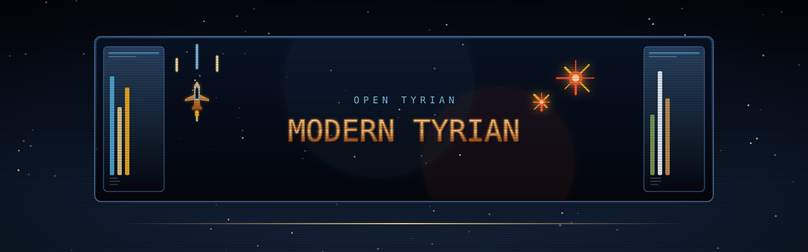
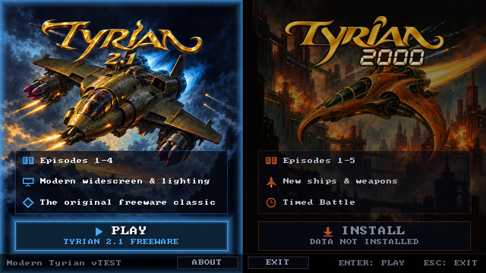
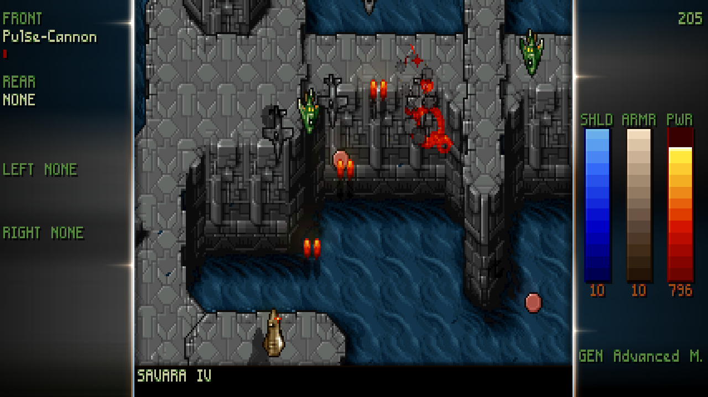
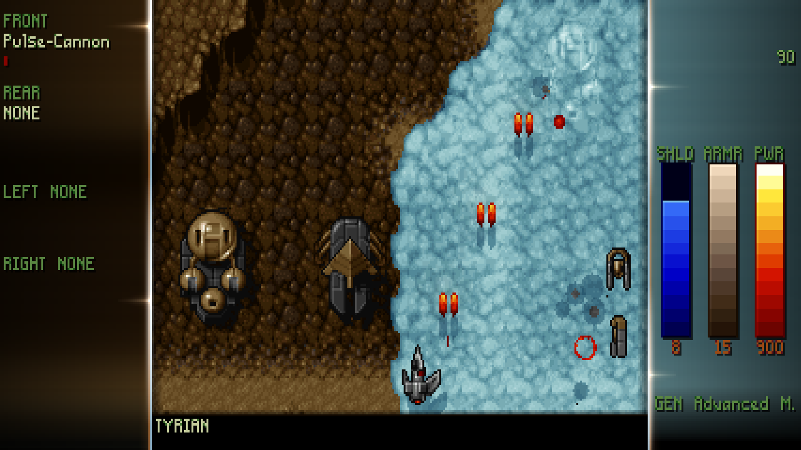
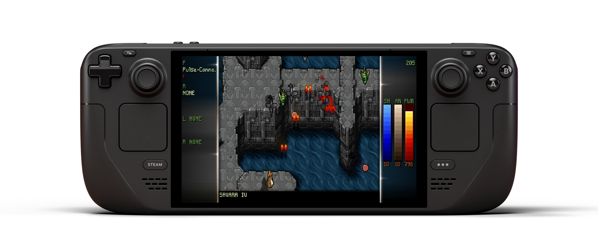

<p align="center">
  
</p>

<p align="center">
  <a href="https://github.com/vittau/modern-tyrian/releases/latest"></a>
  <a href="https://github.com/vittau/modern-tyrian/actions/workflows/linux.yml"></a>
  <a href="https://github.com/vittau/modern-tyrian/actions/workflows/macos.yml"></a>
  <a href="https://github.com/vittau/modern-tyrian/actions/workflows/windows.yml"></a>
  <a href="COPYING"></a>
</p>

<p align="center">
  <b>Tyrian 2.1 + Tyrian 2000</b> in one SDL3 application.<br>
  Classic gameplay, optional Modern presentation, Linux, Windows and macOS.
</p>

Choose either game in the built-in launcher. **Tyrian 2.1 data is included**;
install **Tyrian 2000** separately through the launcher.

<p align="center">
  
  <br><sub>Launcher · 16:9</sub>
</p>

<p align="center">
  
  <br><sub>SAVARA IV · Modern HUD · 16:9</sub>
</p>

<p align="center">
  
  <br><sub>TYRIAN · Arcade · Modern HUD · 16:9</sub>
</p>

## 

[Download the latest release](https://github.com/vittau/modern-tyrian/releases/latest),
extract it and run:

| Platform | Download | Run |
| --- | --- | --- |
| Linux / Steam Deck | `…-linux-x86_64.tar.gz` or `…-linux-arm64.tar.gz` | `./opentyrian` |
| Windows | `…-windows-x86_64.zip` or `…-windows-arm64.zip` | `opentyrian.exe` |
| macOS (Intel + Apple silicon) | `…-macos-universal.zip` | `OpenTyrian.app` |

The launcher accepts keyboard, mouse and gamepad input. Choose **INSTALL** on
the Tyrian 2000 panel to download its verified data from camanis.net, import a
zip, or use an existing folder such as a GOG copy. Steam Deck Game Mode shows
where to place files when a file picker is unavailable. Tyrian 2000 data is
never bundled in releases.

Each game has its own saves and high scores. Existing Tyrian 2.1 saves are
copied into the new namespace automatically; the original is kept.

| User files | Default location |
| --- | --- |
| Windows | `%APPDATA%\OpenTyrian` |
| macOS / Linux | `$XDG_CONFIG_HOME/opentyrian` or `~/.config/opentyrian` |

Configs are shared; saves live in `tyrian21/` and `tyrian2000/`. For portable
mode, place `opentyrian.cfg` beside the executable. The launcher's **About**
screen shows the data paths.

> [!NOTE]
> Builds are unsigned. On macOS, allow the app in **System Settings → Privacy &
> Security**, or run `xattr -dr com.apple.quarantine /path/to/OpenTyrian.app`.
> On Windows, choose **More info → Run anyway** if SmartScreen prompts.

## 

Select **Classic** or **Modern** in *Setup → Graphics → Presentation*.
Both games support Modern mode:

- **Widescreen** from 4:3 to 32:9, with automatic display aspect detection.
- **Bevelled glass HUD** with glowing edges, light glints and inset shadows,
  for campaign and arcade modes, including two players.
- **Smooth motion** at the display refresh rate, bloom, dynamic lighting and VFX.
- **Sharp scaling and HiDPI output**, preserving the original pixel aspect.
- **Gamepad support**, remappable buttons, analog movement and hot-plugging.
- **Nuked-OPL3 audio** for the original FM music.

Graphics changes apply immediately. Dialogs remain centred and the HUD adapts
after display changes. Attract demos use the selected presentation mode.

Classic preserves the original 8-bit framebuffer and RNG order. Modern's
renderer reads game state without changing it. The shared starfield defaults
to 25% speed; `--starfield-speed=100` restores the upstream rate.

## 

<p align="center">
  
  <br><sub>SAVARA IV · Modern HUD · Steam Deck 16:10</sub>
</p>

Add the extracted Linux `opentyrian` executable as a non-Steam game in Desktop
Mode, then return to Game Mode. Leave launch options empty: the launcher opens
normally, with fullscreen Modern presentation and native controller support.
See [Steam Deck setup and troubleshooting](docs/STEAM_DECK.md).

## 

| Action | Keyboard | Gamepad |
| --- | --- | --- |
| Move | Arrow keys | Left stick / D-pad |
| Fire / confirm | Space / Enter | A |
| Rear weapon / back | Enter / Esc | B |
| Left sidekick | Left Ctrl | Y / LB |
| Right sidekick | Left Alt | X / RB |
| In-game menu | Esc | Start |
| Pause | P | Back / View |
| Fullscreen | Alt+Enter | — |

Remap controls in *Setup → Keyboard / Joystick*. Menus also accept the mouse.
For network play, use `--net HOST --net-player-name NAME --net-player-number N`
on both machines (UDP port 1333).

## 

Requires a C99 compiler, GNU make, pkg-config, SDL3 and optionally SDL3_net.

```sh
make
./get_data.sh                 # freeware Tyrian 2.1 data
./opentyrian
```

- **macOS:** `brew install pkgconf sdl3 sdl3_net`; `./make_macos.sh` builds a universal app.
- **Linux:** `./make_linux.sh` builds with static SDL3 and SDL3_net.
- **Windows:** build with MSYS2 and its SDL3/SDL3_net packages; `visualc/` also contains a Visual Studio solution.
- **Development:** `make debug` or `make asan`; run `make clean` when switching build modes.

## 

Run `./opentyrian --help` for all options. Common ones:

| Option | Purpose |
| --- | --- |
| `--variant=2.1` / `--variant=2000` | Start a game directly, skipping the launcher |
| `--data=DIR` | Use an explicit game-data folder |
| `--install-2000=download` | Download and install Tyrian 2000 data |
| `--install-2000=PATH` | Install from a zip or folder |
| `--presentation=classic\|modern` | Select presentation |
| `--aspect=16:9` | Set Modern aspect (`auto`, `4:3`, `16:10`, `21:9`, `32:9` also supported) |
| `--no-sound` / `--no-joystick` | Disable audio / controller input |

For Tyrian 2000, `TYRIAN2000_DATA` or a `tyrian2000/` folder beside the executable
also works. The launcher installs data per user and shows its location in **About**.

## 

```sh
make regress                              # Tyrian 2.1 + architecture/installer/display guards
make regress-2000 TYRIAN2000_DATA=DIR       # separately installed Tyrian 2000 data
```

CI runs both suites on Linux, macOS and Windows. Deterministic frame and state
hashes cover gameplay, menus, saves, bosses, gamepads and launcher handoff.
Tyrian 2000 test data is downloaded into temporary storage, never cached or
packaged. Long interpolation and smoothness sweeps run only in the manual
[full regression workflow](.github/workflows/regress-full.yml).

## 

- **Tyrian** was developed by **Eclipse Software** (Jason Emery and
  contributors) and published by Epic MegaGames in 1995; it was released as
  freeware in 2004. The freeware 2.1 data is redistributed under its own
  licence, [`doc/tyrian-freeware-license.txt`](doc/tyrian-freeware-license.txt).
- **OpenTyrian** is the open-source port this project is based on, by the
  [OpenTyrian Development Team](https://github.com/opentyrian/opentyrian).
- **Tyrian 2000** support is ported from [KScl/opentyrian2000](https://github.com/KScl/opentyrian2000), commit `aad5aca` (GPL-2.0). Its game data is installed separately.
- **Nuked-OPL3** by Nuke.YKT (commit `765ec962`) emulates the AdLib/OPL2 FM
  music. It is vendored under `src/nuked_opl3.c` / `src/nuked_opl3.h` and used
  under the GNU LGPL v2.1 or later; see `LICENSE-Nuked-OPL3`.
- **SDL3** and **SDL3_net** provide the platform layer. SDL3_net is only used
  for network play.
- The README art uses **Press Start 2P** by CodeMan38, under the SIL Open Font
  License; the font and its licence are in
  [`docs/readme/fonts/`](docs/readme/fonts/).

This project's own source is free software, released under the **GNU General
Public License v2.0 or later**; see [`COPYING`](COPYING).

- project: <https://github.com/opentyrian/opentyrian>
- irc: <ircs://irc.oftc.net/#opentyrian>
- forums: <https://tyrian2k.proboards.com/board/5>
